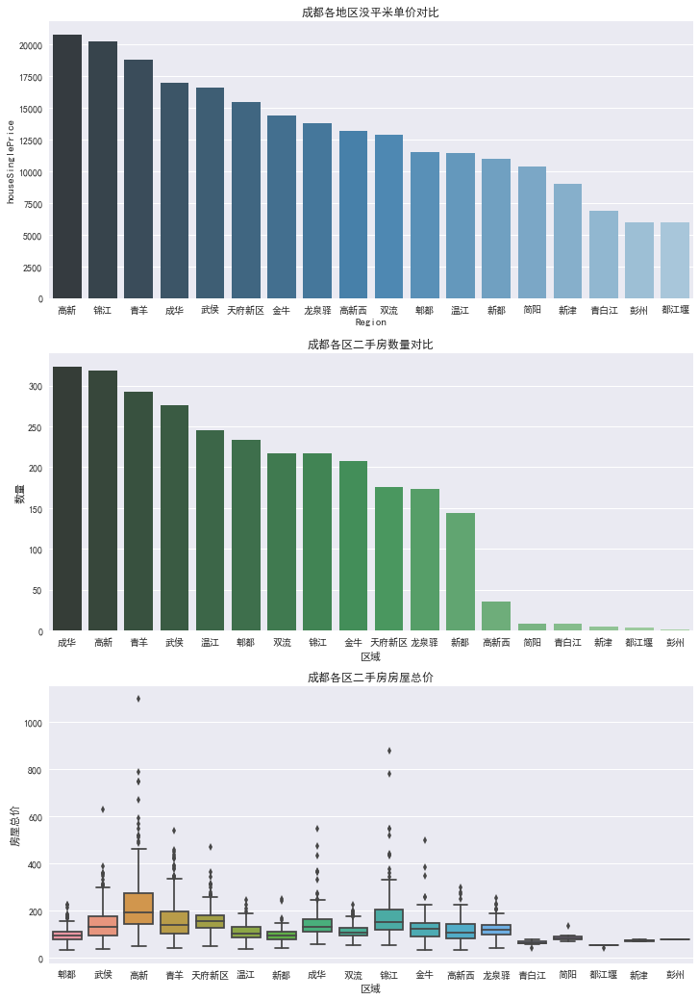
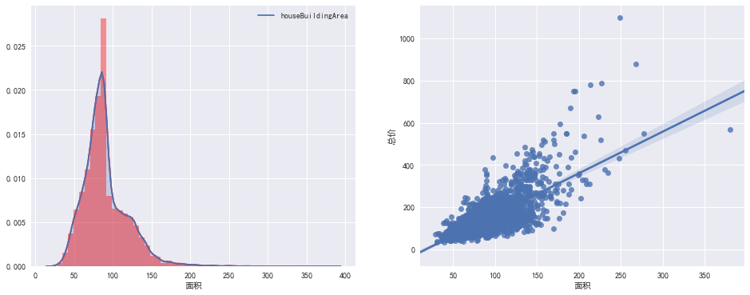
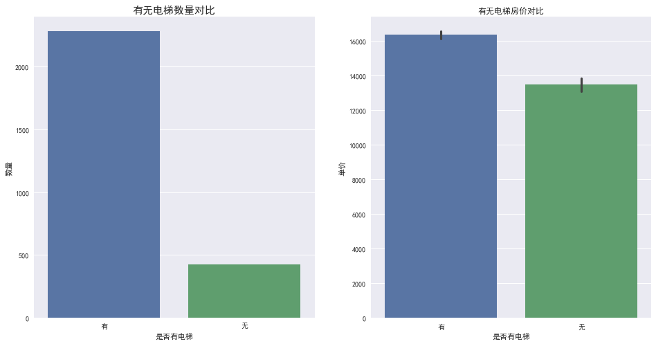
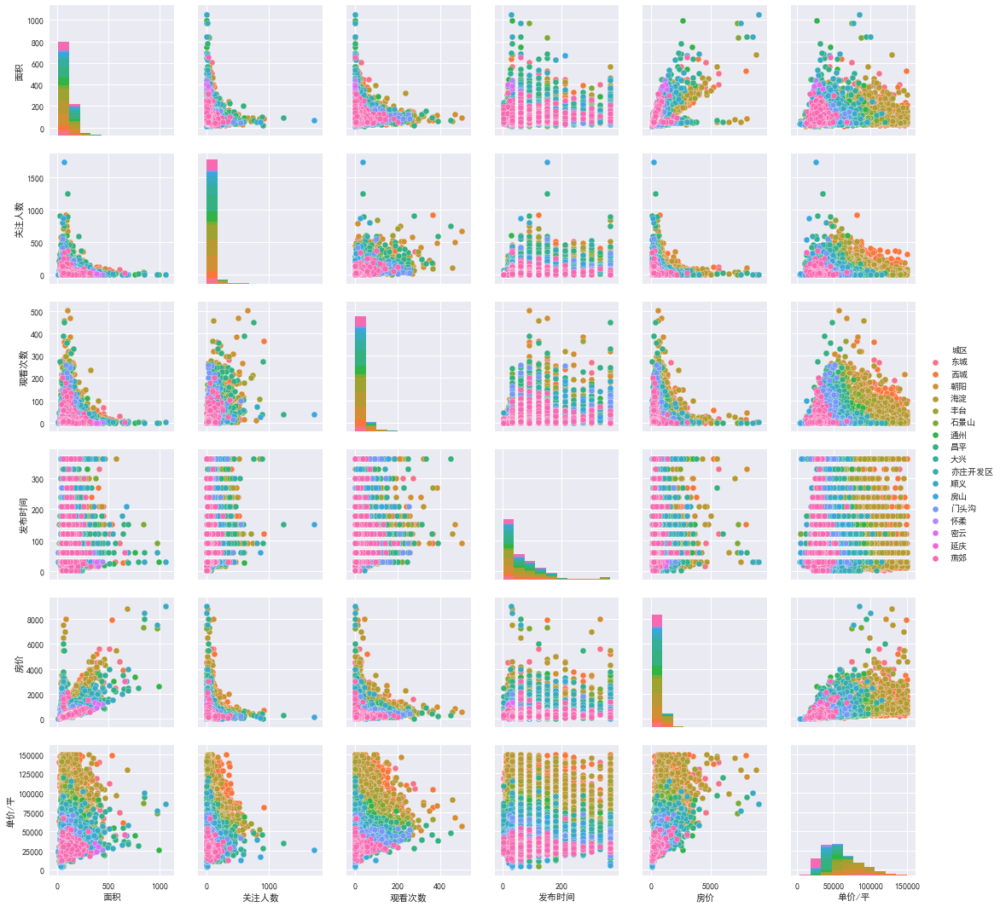
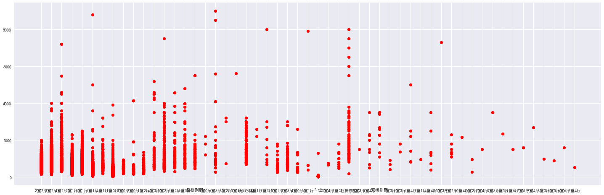
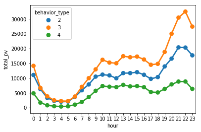

**目录 (Table of Contents)**

* [初始准备包引入](#初始准备)
* [解决图表显示方块丢失中文问题](#解决图表显示方块丢失中文问题)
* [比较地区与房屋单价金额数量的关系](#例1：（树状图、箱形图）比较地区与房屋单价金额数量的关系)
* [房屋面积的大小比例，面积与价格关系](#例2：（质量直方图、线性集中关系图、树状图）面积的大小比例，面积与价格关系)
* [直观比较多个属性间的关系](#例3：描述数据集不同属性间的关系)
* [分类形数据散点图绘制](#例4：非连续性数据，分类与数值散点图展示)
* [点图展示PV变化情况](#例5：点图展示不同时候PV值变化)

# 初始准备
````python
    import pandas as pd
    import matplotlib.pyplot as plt
    import seaborn as sns
    import re
````

# 解决图表显示方块丢失中文问题
````python
    plt.rcParams['font.sans-serif'] = ['SimHei']  # 中文字体设置-黑体
    plt.rcParams['axes.unicode_minus'] = False  # 解决保存图像是负号'-'显示为方块的问题
    sns.set(font='SimHei')  # 解决Seaborn中文显示问题
````

# 例1：（树状图、箱形图）比较地区与房屋单价金额数量的关系

## 1.  数据结构
  
    <class 'pandas.core.frame.DataFrame'>
    RangeIndex: 2993 entries, 0 to 2992
    Data columns (total 32 columns):
    houseId                   2993 non-null int64
    houseTitle                2993 non-null object
    houseTotalMoney           2993 non-null object
    houseSinglePrice          2993 non-null object
    houseDownPayment          2993 non-null object
    houseGardenName           2993 non-null object
    houseLocation             2993 non-null object
    houseNumber               2993 non-null int64
    houseType                 2993 non-null object
    houseFloor                2993 non-null object
    houseBuildingArea         2993 non-null object
    houseStructure            2993 non-null object
    houseInnerArea            2993 non-null object
    houseBuildingType         2993 non-null object
    houseOrientation          2993 non-null object
    houseBuildingStructure    2993 non-null object
    houseDecoration           2993 non-null object
    houseElevatorRatio        2985 non-null object
    houseElevator             2985 non-null object
    housePrivilege            2985 non-null object
    houseListDate             2993 non-null object
    houseTradeProperty        2993 non-null object
    houseLastTrade            2993 non-null object
    houseUsage                2993 non-null object
    houseAgeLimit             2993 non-null object
    housePrivilegeProperty    2993 non-null object
    housePledge               2993 non-null object
    houseRecord               2993 non-null object
    houseImg                  2890 non-null object
    houseUrl                  2993 non-null object
    houseRefererUrl           2993 non-null object
    houseCrawlTime            2993 non-null object
    dtypes: int64(2), object(30)
    memory usage: 748.3+ KB

## 2.  关系展示
````python
    # 设置三个图表ax1,ax2,ax3的大小 : 3列1行 每个12×18大小
    f,[ax1,ax2,ax3] = plt.subplots(3,1,figsize=(12,18))
    
    # 1.数据准备
    df_house_mean = house_df.groupby('Region')['houseSinglePrice'].mean().sort_values(ascending=False).to_frame().reset_index()
    
    # 1.数据展示
    sns.barplot(x='Region', y='houseSinglePrice', palette='Blues_d', data=df_house_mean, ax=ax1)
    ax1.set_title('成都各地区没平米单价对比')
    ax1.set_xlabel('区域')
    ax1.set_ylabel('每平米单价')
    
    # 2.数据准备
    df_house_count = house_df.groupby('Region')['houseId'].count().sort_values(ascending=False).to_frame().reset_index()
    df_house_count.rename(columns = {'houseId':'Count'},inplace='True')
    
    # 2.数据展示
    sns.barplot(x='Region', y='Count', palette='Greens_d', data=df_house_count, ax=ax2)
    ax2.set_title('成都各区二手房数量对比')
    ax2.set_xlabel('区域')
    ax2.set_ylabel('数量')

    # 3.数据展示
    sns.boxplot(x='Region', y='houseTotalMoney', data=house_df, ax=ax3)
    ax3.set_title('成都各区二手房房屋总价')
    ax3.set_xlabel('区域')
    ax3.set_ylabel('房屋总价')
````


# 例2：（质量直方图、线性集中关系图、树状图）面积的大小比例，面积与价格关系

## 1.  数据结构
  
    <class 'pandas.core.frame.DataFrame'>
    RangeIndex: 2993 entries, 0 to 2992
    Data columns (total 32 columns):
    houseId                   2993 non-null int64
    houseTitle                2993 non-null object
    houseTotalMoney           2993 non-null object
    houseSinglePrice          2993 non-null object
    houseDownPayment          2993 non-null object
    houseGardenName           2993 non-null object
    houseLocation             2993 non-null object
    houseNumber               2993 non-null int64
    houseType                 2993 non-null object
    houseFloor                2993 non-null object
    houseBuildingArea         2993 non-null object
    houseStructure            2993 non-null object
    houseInnerArea            2993 non-null object
    houseBuildingType         2993 non-null object
    houseOrientation          2993 non-null object
    houseBuildingStructure    2993 non-null object
    houseDecoration           2993 non-null object
    houseElevatorRatio        2985 non-null object
    houseElevator             2985 non-null object
    housePrivilege            2985 non-null object
    houseListDate             2993 non-null object
    houseTradeProperty        2993 non-null object
    houseLastTrade            2993 non-null object
    houseUsage                2993 non-null object
    houseAgeLimit             2993 non-null object
    housePrivilegeProperty    2993 non-null object
    housePledge               2993 non-null object
    houseRecord               2993 non-null object
    houseImg                  2890 non-null object
    houseUrl                  2993 non-null object
    houseRefererUrl           2993 non-null object
    houseCrawlTime            2993 non-null object
    dtypes: int64(2), object(30)
    memory usage: 748.3+ KB

## 2.  关系展示
````python
    # 设置两个图表ax1,ax2的大小 : 1列2行 每个16×6大小
    f, [ax1,ax2] = plt.subplots(1, 2, figsize=(16, 6))
    
    # 房屋面积
    sns.distplot(house_df['houseBuildingArea'], ax=ax1, color='r')
    sns.kdeplot(house_df['houseBuildingArea'], shade=True, ax=ax1)
    ax1.set_xlabel('面积')

    # 房屋面积和价格的关系
    sns.regplot(x='houseBuildingArea', y='houseTotalMoney', data=house_df, ax=ax2)
    ax2.set_xlabel('面积')
    ax2.set_ylabel('总价')
    
    # -------------------------------------------------------------------------------------------
    
    f, [ax1, ax2] = plt.subplots(1, 2, figsize=(16, 8))
    
    # 数据准备
    elevator_df =  house_df[house_df['houseElevator'] != '暂无数据']
    elevator_df['houseElevator'].value_counts()

    sns.countplot(x = 'houseElevator',data = elevator_df, ax=ax1)
    ax1.set_title('有无电梯数量对比', fontsize=15)
    ax1.set_xlabel('是否有电梯')
    ax1.set_ylabel('数量')

    sns.barplot(x='houseElevator', y='houseSinglePrice', data=elevator_df, ax=ax2)
    ax2.set_title('有无电梯房价对比')
    ax2.set_xlabel('是否有电梯')
    ax2.set_ylabel('单价')
````



# 例3：描述数据集不同属性间的关系

## 1.  数据结构
    
    <class 'pandas.core.frame.DataFrame'>
    RangeIndex: 23440 entries, 0 to 23439
    Data columns (total 11 columns):
    简介      23440 non-null object
    小区      23440 non-null object
    户型      23440 non-null object
    面积      23440 non-null float64
    关注人数    23440 non-null float64
    观看次数    23440 non-null float64
    发布时间    23440 non-null int64
    房价      23440 non-null float64
    单价/平    23440 non-null float64
    城区      23440 non-null object
    经纬度     23440 non-null object
    dtypes: float64(5), int64(1), object(5)
    memory usage: 2.0+ MB

## 2.  关系展示
````python
   # hue参数进行分组展示，可选
   # sns.pairplot(data,kind="reg",diag_kind="kde") 拟合回归直线
   # kind 控制非对角线
   # diag_kind 控制对角线
   sns.pairplot(data,hue="城区")
````



# 例4：非连续性数据，分类与数值散点图展示

## 1.  数据结构
    
    <class 'pandas.core.frame.DataFrame'>
    RangeIndex: 23440 entries, 0 to 23439
    Data columns (total 11 columns):
    简介      23440 non-null object
    小区      23440 non-null object
    户型      23440 non-null object
    面积      23440 non-null float64
    关注人数    23440 non-null float64
    观看次数    23440 non-null float64
    发布时间    23440 non-null int64
    房价      23440 non-null float64
    单价/平    23440 non-null float64
    城区      23440 non-null object
    经纬度     23440 non-null object
    dtypes: float64(5), int64(1), object(5)
    memory usage: 2.0+ MB

## 2.  关系展示
````python
   plt.subplots(figsize=(25,8))
   plt.scatter(data['户型'],data['房价'],color='red')
````


# 例5：点图展示不同时候PV值变化

## 1.  数据结构
    
    
    <class 'pandas.core.frame.DataFrame'>
    RangeIndex: 12256906 entries, 0 to 12256905
    Data columns (total 6 columns):
    user_id          int64
    item_id          int64
    behavior_type    int64
    user_geohash     object
    item_category    int64
    time             object
    dtypes: int64(4), object(2)
    memory usage: 561.1+ MB

## 2.  关系展示
````python
   pv_detail = data_user.groupby(['behavior_type','hour'])['user_id'].count().reset_index().rename(columns={'user_id':'total_pv'})
   sns.pointplot(x='hour',y='total_pv',hue='behavior_type',data = pv_detail[pv_detail['behavior_type'] != 1])
````
