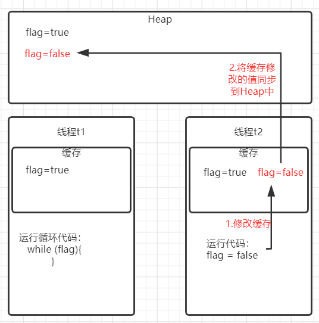

本文将会介绍在并发编程中，内存的可见性到底指的是什么，以及volatile是如何提供可见性从而保证线程安全的。

为了帮助我们更好的理解我们首先尝试运行下面这个例子:
``` java
    public static boolean  flag = true;

    public static void main(String[] args){
        Thread t1 = new Thread(()->{
            while (flag){
            }
            System.out.println("stop");
        });
        t1.start();

        System.out.println("主线程正在运行") ;

        Thread t2 = new Thread(()->flag = false);
        t2.start();

        System.out.println("主线程退出了！");
    }

```
运行过后我们会发现，这个例子可能会导致死循环的发生，在这个例子里线程t2修改了修饰符flag，将flag修改为了false，按照我们的理解t1这时候应该会推出while循环，因为flag变成了false，可是事实上却可能不会发生，t1会永远退出了不while循环，最后导致了死循环。

要弄明白为什么会这个出现这样的死循环，我们先要明白JVM运行这段代码的时候发生了什么。


如上图所示，线程t2修改了 flag 变量时，会将变量写回缓存-》写回Heap,但是这里有个问题，线程t1并不知道flag被t2修改了，它依然会从自己缓存中读取数据，此时读到的依然是flag=true，所以会导致死循环的发生。
知道原因后要解决也很简单，只要我们让线程t1知道flag被其它线程进行了修改，那就可以了，线程t1会更新flag的值也就不会出现死循环了。
那如何让t1线程知道flag被其它线程修改了呢？

下面就会介绍我们的主角volatile关键字。当我们给flag变量加了volatile关键字后：
``` java
public volatile static boolean  flag = true;
```
我们再次运行这个代码，死循环将不再发生，volatile最重要的一个作用就是告诉JVM“这个变量不要被其他线程拷贝副本到自己的内存中，始终从共享内存中读取数据”这样的话当t2线程修改flag变量后，t1线程会直接从共享内存中读取到flag的值为false，所以循环自然就终止了，这里其实是volatile提供了可见性。

在测试代码的时候我还发现了一个有意思的现象，我对代码进行了修改，没有使用volatile的情况下代码测试多次也没有出现死循环。例：
``` java
    public static boolean  flag = true;

    public static void main(String[] args){
        Thread t1 = new Thread(()->{
            while (flag){
                System.out.println(flag));
            }
            System.out.println("stop");
        });
        t1.start();

        System.out.println("主线程正在运行") ;

        Thread t2 = new Thread(()->flag = false);
        t2.start();

        System.out.println("主线程退出了！");
    }

```
这个例子其实就是在循环里把flag变量进行了打印，我感到十分好奇，在这种情况下为什么也不会死循环，难道是打打印变量的时候t1线程会从Heap中重新读取变量的新值吗？
为了解答这个疑惑让我们一起来看下System.out.println的源码：
``` java
public void println(String x) {
        synchronized (this) {
            print(x);
            newLine();
        }
    }
```
原来是源码里有synchronized关键字，synchronized在获取锁的时候会强制性的加载可访问到的值到线程工作内存中来，大白话说就是会刷新缓存里的变量，更新为Heap里最新的值，所以这个时候会将flag变为false，循环自然就终止了。
想必大家对内存可见性有了一定的理解了，volatile其实还有一个很重要的性质叫做“防止指令重排序”
下章我们有机会的话再来介绍下什么是指令重排序，以及防止重排序的意义。

